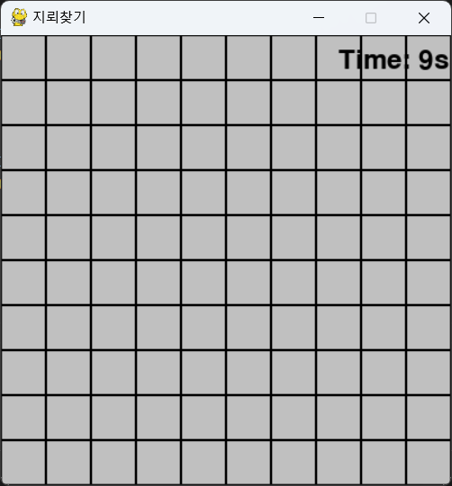

# 🚀 Minesweeper Game  
지뢰찾기 게임을 파이썬(Pygame)으로 구현한 프로젝트입니다! 🎮  

## 📷 스크린샷  


## 🎯 게임 소개  
- 10x10 그리드에서 지뢰를 피하면서 모든 빈 칸을 오픈하세요!  
- 깃발(우클릭)로 지뢰가 있을 것 같은 곳을 표시할 수 있습니다.  
- 타이머 기능이 있어 최단 시간 도전이 가능합니다.  

## 🛠 사용 기술  
- Python 🐍  
- Pygame 🎮  

## 🚀 실행 방법  
1️⃣ Python 설치  
2️⃣ 저장소 클론  
```bash
git clone https://github.com/YourUsername/Minesweeper.git
cd Minesweeper
